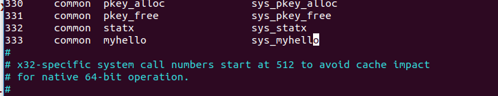

## 添加系统调用

### 实验目的：

向现有Linux内核加入一个新的系统调用从而在内核空间中实现对用户空间的读写。
例如，设计并实现一个新的内核函数mycall( )，此函数通过一个引用参数的调用返回当前系统时间，功能上基本与gettimeofday( )相同。
也可以实现具有其它功能的系统调用。

### 实验步骤

#### 1. 下载linux内核 

`cd /usr/src`

`sudo apt install linux-source`

下载完解压到当前目录

`tar -xvf linux-source-4.15.0.tar`(视当前版本而定)

#### 2. 分配系统调用号

`cd /usr/src/linux-source-4.15.0/linux-source-4.15.0/arch/x86/entry/syscalls`

`sudo vim syscall_64.tbl`

添加系统调用号


#### 3. 申明系统调用服务例程原型

`/usr/src/linux-source-4.15.0/linux-source-4.15.0/include/linux`

`sudo vim syscalls.h`

末尾添加：

`asmlinkage long sys_myhello (pid_t pid, int flag, int value, void __user * prio, void __user * hello)`


其中“asmlinkage”是一个必须的限定词，用于通知编译器仅从堆栈中提取该函数的参数，而不是从寄存器中，因为在执行服务例程之前系统已经将通过寄存器传递过来的参数值压入内核堆栈了。

#### 4. 实现系统调用服务

`cd /usr/src/linux-source-4.15.0/linux-source-4.15.0/kernel`

`sudo vim sys.c`

添加下面的代码

```
/*
 * my scall 
 * 添加一个系统调用，实现对指定进程的 hello 值的修改或读取功能，
 * 并返回进程最新的 hello 值及优先级 prio。
 * 参数含义：
 *     pid：进程 ID。
 *     flag：若值为 0，表示读取 hello 值；若值为 1，表示修改 hello 值。
 *     prio hello：进程当前优先级及 hello 值。
 * 返回值：系统调用成功时返回 0，失败时返回错误码 EFAULT。
 */
SYSCALL_DEFINE5(myse hello, pid_t, pid, int, flag, int, hellovalue, void __user *, prio, void __user *, hello)
{
	struct pid * kpid;
	struct task_struct * task;
	int hellobef; 
	int priobef;
	kpid = find_get_pid(pid);   // 返回 pid
	task = pid_task(kpid, PIDTYPE_PID);  // 返回 task_struct
 hellobef = task hello(task);
	priobef = task_prio(task);
	
	if(flag == 1){
		set_user hello(task, hellovalue);
		printk("修改前 hello值：%d\t修改后 hello值：%d\n", hellobef, hellovalue);
		return 0;
	}
	else if(flag == 0){
		copy_to_user hello, (const void*) hellobef, sizeof hellobef));
		copy_to_user(prio, (const void*)&priobef, sizeof(priobef));
		printk("该进程 hello值是：%d\n", hellobef);
		printk("该进程的prio值是：%d\n", priobef);
		return 0;
	}

	printk("你输入的 flag 有误，请重新输入!\n");
	return EFAULT;
}
```


在新版本的内核中，引入了宏“SYSCALL_DEFINEN(sname)”对服务例程原型进行了封装，其中的“N”是该系统调用所需要参数的个数， 在这里我们使用了 5 个参数所以是 DEFINE5。

#### 5. 内核编译

(1) 清除残留的.config和.o文件

编译出错需要重新编译或不是第一次编译，都需要清除残留的.config 和.o 文件，方法是进入Linux内核所在的子目录， 执行以下命令：

`sudo make mrproper`

这里可能会提醒安装 ncurses 包，在 ubuntu 中 ncurses 库的名字是 libncurses5-dev，所

以安装命令是：

`sudp apt-get install libncurses5-dev`

(2) 配置内核

`sudo make menuconfig`

运行该命令过程中，可能会报错提示缺少一个套件 ncurses devel，那么你需要手动对其进行安装，安装方法同上安装 ncurses 包的过程。

在执行 make menuconfig 命令的时候会出现一个配置对话框，我们一般采用默认值：选择<save>保存配置信息，然后选择<exit>退出对话框。

(3) 编译内核，生成启动镜像文件

`sudo make`

这里也许会提示你没有安装 openssl，安装的方法如下：

`sudo apt-get install libssl-dev`

内核编译的时间有很长，大概需要一到两个小时。

(4) 编译模块

`sudo make modules`

(5) 安装内核

安装模块：

`sudo make modules_install`

安装内核：

`sudo make install`

(6)配置grub引导程序

`sudo update-grub2`

自动修改grub

(7) 重启系统

查看新内核是否为我们重新编译的内核版本

`uname -a`

#### 6. 编写用户态测试程序

```
#define _GNU_SOURCE
#include <unistd.h>
#include <sys/syscall.h>
#include <stdio.h>
#define __NR_myhello 333 //系统调用号

int main() {
    pid_t tid;
    int hellovalue;
    int prio = 0;
    int hello = 0;
    tid = getpid();
    syscall(__NR_myhello,tid,0,-5,&prio,&hello);//read
    printf("pid: %d\nprio: %d\nhello: %d\n", tid, prio,hello);
    syscall(__NR_myhello,tid,1,-5,&prio,&hello);//set
    printf("pid: %d\nprio: %d\nhello: %d\n", tid, prio,hello);
    syscall(__NR_myhello,tid,0,-5,&prio,&hello);//read
    printf("pid: %d\nprio: %d\nhello: %d\n", tid, prio,hello);  
    printf("*******************************\n");
    syscall(__NR_myhello,tid,0,-15,&prio,&hello);//read
    printf("pid: %d\nprio: %d\nhello: %d\n", tid, prio,hello);
    syscall(__NR_myhello,tid,1,-15,&prio,&hello);//set
    printf("pid: %d\nprio: %d\nhello: %d\n", tid, prio,hello);
    syscall(__NR_myhello,tid,0,-15,&prio,&hello);//read
    printf("pid: %d\nprio: %d\nhello: %d\n", tid, prio,hello);          
    return 0;
}
```


在这里我们设置的 hello 值参数表示的是与执行指令的优先权等级，等级范围为 -20 ~ 19。数值越小，等级越高。只有系统管理者才可以设置负数的等级。


### 参考链接

https://zhuanlan.zhihu.com/p/31342840